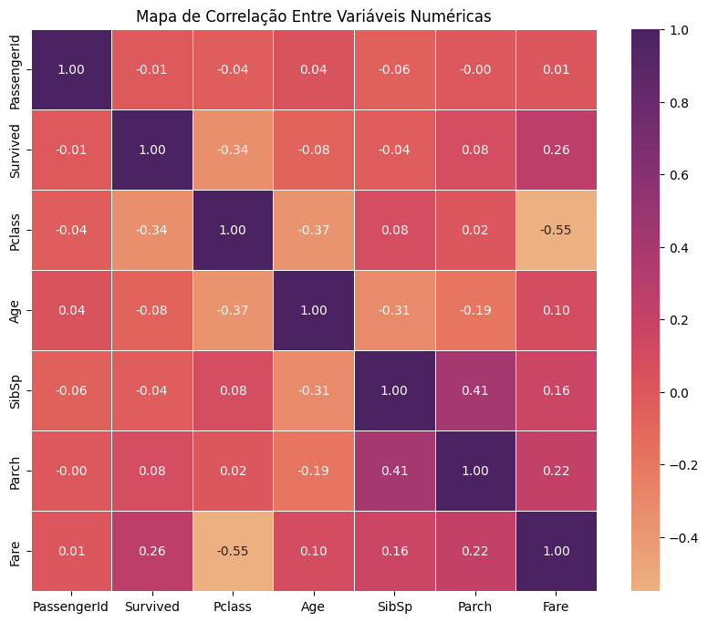
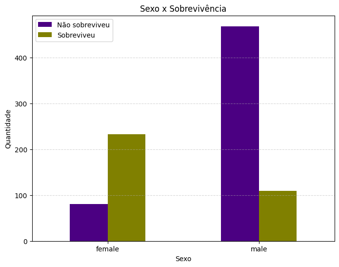
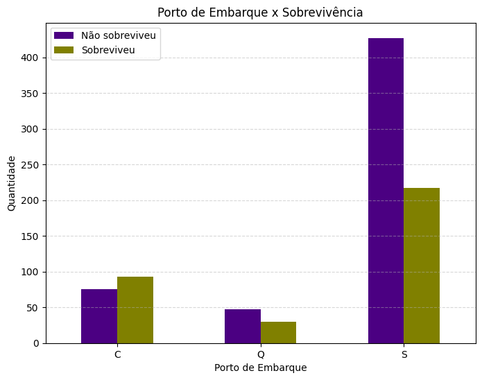
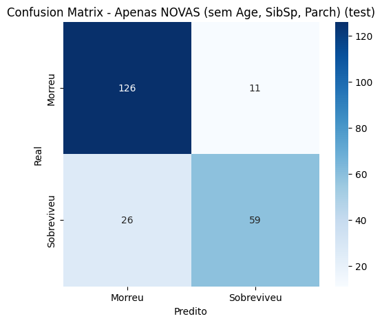

# 🚢 Titanic Survival Prediction - Multilayer Perceptron (MLP)


## 📋 Sobre o Projeto

Este projeto consiste na implementação de um modelo preditivo baseado em **Redes Neurais Artificiais (Multilayer Perceptron - MLP)** para estimar a probabilidade de sobrevivência de passageiros do naufrágio do Titanic.

O desenvolvimento utiliza o famoso banco de dados disponível no [Kaggle](https://www.kaggle.com/c/titanic) e segue um rigoroso pipeline de ciência de dados, desde a análise exploratória até a otimização de hiperparâmetros e validação em dados de teste.

## 🎯 Objetivos

O foco principal deste trabalho é a aplicação prática de conceitos de Deep Learning com as seguintes metas específicas:

1. **EDA (Análise Exploratória de Dados):** Compreensão das variáveis e padrões de sobrevivência.
2. **Divisão Estratégica dos Dados:** Separação do dataset em **50% Treinamento, 25% Validação e 25% Teste**.
3. **Pré-processamento:** Limpeza, imputação de nulos e codificação de variáveis categóricas.
4. **Balanceamento de Classes:** Aplicação de técnicas de **Oversampling** na classe minoritária do conjunto de treino.
5. **Modelagem MLP:** Construção e treinamento de redes neurais.
6. **Otimização:** Ajuste de hiperparâmetros baseado em métricas de validação.
7. **Avaliação Final:** Teste do melhor modelo em dados nunca vistos.

## 🛠️ Tecnologias Utilizadas

* **Linguagem:** Python
* **Manipulação de Dados:** Pandas, NumPy
* **Visualização:** Matplotlib, Seaborn
* **Machine Learning/Deep Learning:** Scikit-learn, TensorFlow/Keras (ou PyTorch - *ajuste conforme seu código*)

## 📊 Metodologia e Pipeline

### 1. Análise Exploratória (EDA)
Foi realizada uma análise profunda para entender correlações, como a taxa de sobrevivência por gênero, classe socioeconômica e idade.

### 2. Divisão do Dataset
Diferente da divisão padrão 70/30 ou 80/20, este projeto seguiu a seguinte especificação rigorosa:
* **Treinamento (50%):** Usado para ajustar os pesos da rede.
* **Validação (25%):** Usado para tunar hiperparâmetros e evitar overfitting durante o treino.
* **Teste (25%):** Usado exclusivamente para a avaliação final do modelo.

### 3. Tratamento de Dados
* Normalização de variáveis numéricas (StandardScaler/MinMaxScaler).
* One-Hot Encoding para variáveis categóricas.
* Tratamento de valores ausentes (Missing Values).

### 4. Oversampling
Identificou-se desbalanceamento nas classes (mais vítimas do que sobreviventes). Foi aplicada técnica de oversampling (ex: SMOTE ou RandomOverSampler) apenas nos dados de **treinamento** para garantir que o modelo aprenda padrões de ambas as classes sem viés.

### 5. Arquitetura da MLP
O modelo base consiste em um Perceptron Multicamadas (Feedforward Neural Network).


* **Camada de Entrada:** Compatível com o número de features processadas.
* **Camadas Ocultas:** Testadas com diferentes funções de ativação (ReLU, Sigmoid, Tanh).
* **Camada de Saída:** Neurônio único com ativação Sigmoid (classificação binária).

## 📊 Análise Exploratória (EDA)

Antes da modelagem, foram analisadas as correlações entre variáveis.

### Mapa de Calor (Correlação)
A análise de correlação mostrou que `SibSp` e `Parch` possuem forte relação, justificando a criação da feature `Family`.


### Sobrevivência por Gênero e Porto
Notou-se uma maior taxa de sobrevivência entre mulheres e passageiros que embarcaram em portos específicos.
<div style="display: flex; justify-content: space-between;">
  
  
</div>

---

## 📈 Resultados do Modelo

Após a otimização dos hiperparâmetros (GridSearch), o melhor modelo MLP obteve o seguinte desempenho na classificação dos passageiros do conjunto de teste:

| Métrica | Resultado |
| :--- | :--- |
| Acurácia | 83.33% |
| Precisão | 0.84 |
| Recall | 0.69 |
| F1-Score | 0.76 |

### Matriz de Confusão
A matriz abaixo detalha os acertos e erros do modelo final.



## 🚀 Como Executar

1. Clone o repositório:
   ```bash
   git clone [https://github.com/SEU_USUARIO/NOME_DO_REPO.git](https://github.com/SEU_USUARIO/NOME_DO_REPO.git)

   Instale as dependências:

    pip install -r requirements.txt

   Execute o Notebook:
    Projeto_Machine_Learning(MLP).ipynb
   ```
# ✒️ Autor
Alisson da Silva Bernadino - LinkedIn https://www.linkedin.com/in/alisson-da-silva-bernadino-6535b3318/

